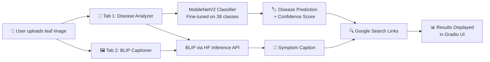

<div align="center">

# 🌿🩺 Plant Disease Doctor

### *An AI‑Powered Deep Learning System for Identifying 38 Plant Diseases from Leaf Images*

[](https://python.org)
[](https://tensorflow.org)
[](https://huggingface.co)
[](https://kaggle.com)
[](https://gradio.app)

<a href="https://huggingface.co/spaces/Umer78786/Plants-Disease">
  
</a>

</div>

---


---

## 📖 Table of Contents

- [Overview](#-overview)
- [Features](#-features)
- [Tech Stack & Architecture](#-tech-stack--architecture)
- [Dataset](#-dataset)
- [Training Details](#-training-details)
- [Deployment Challenges & Lessons](#-deployment-challenges--lessons)
- [Usage](#-usage)
- [Folder Structure](#-folder-structure)
- [Requirements](#-requirements)
- [Acknowledgements](#-acknowledgements)

---

## 🌍 Overview

Every year, crop diseases destroy up to **40% of global food production** — that's enough food to feed hundreds of millions of people. For smallholder farmers in developing regions, the problem is even more acute: they often lack access to agronomists or plant pathologists who can diagnose diseases before it's too late. By the time visible symptoms spread, entire harvests can be lost.

**Plant Disease Doctor** is a deep learning‑based web application designed to bridge this gap. Simply upload a photo of a diseased leaf, and within seconds the system identifies which of **38 plant diseases** is affecting the crop — complete with an AI‑generated visual description of the symptoms and direct search links to see real‑world examples of the identified disease.

Built with **MobileNetV2** for lightweight, efficient classification and **BLIP (Bootstrapping Language‑Image Pre‑training)** by Salesforce for rich image captioning, the system achieves **92% validation accuracy** across 38 disease categories spanning crops like apples, tomatoes, corn, potatoes, grapes, and more. It's designed not just as a technical showcase, but as a practical tool that farmers, agronomists, and gardening enthusiasts can use in the field — right from their phone's browser.

<div align="center">

| Metric | Value |
|--------|-------|
| 🎯 Validation Accuracy | **92%** |
| 🧬 Disease Classes | **38** |
| 🖼️ Training Images | **~87,000** |
| ⚡ Model Size (MobileNetV2) | **~14 MB** |
| 💰 Deployment Cost | **Free (HF Spaces CPU)** |

</div>

---

## ✨ Features

### 🔬 Multi‑Disease Classification (38 Classes)

The classifier recognises diseases across **14 crop species**, including:

| Crop | Example Diseases |
|------|-----------------|
| 🍎 Apple | Apple Scab, Black Rot, Cedar Apple Rust |
| 🍅 Tomato | Early Blight, Late Blight, Septoria Leaf Spot, Target Spot |
| 🌽 Corn (Maize) | Cercospora Leaf Spot, Common Rust, Northern Leaf Blight |
| 🥔 Potato | Early Blight, Late Blight |
| 🍇 Grape | Black Rot, Esca (Black Measles), Leaf Blight |
| 🫐 Blueberry | Bacterial Leaf Spot (Healthy check) |
| 🍊 Orange | Haunglongbing (Citrus Greening) |
| 🌶️ Pepper | Bacterial Leaf Spot |
| 🥒 Cucumber | (Healthy check) |
| 🍓 Strawberry | Leaf Scorch |
| 🫑 Squash | Powdery Mildew |
| 🍑 Peach | Bacterial Spot |
| 🌾 Rice | (Healthy check) |
| 🥬 Soybean | (Healthy check) |

### 🤖 AI‑Powered Symptom Captioning

Beyond a simple class label, the system leverages **Salesforce BLIP** to generate a natural‑language description of the leaf's visual symptoms — e.g., *"Yellowish-brown spots with dark concentric rings on the leaf surface, indicative of early-stage fungal infection."* This provides context and helps even non‑expert users understand what's happening to their plant.

### 🔍 One‑Click Disease Search Links

Each prediction includes auto‑generated **Google search links** so users can instantly explore real‑world photographs, treatment guides, and community discussions about the identified disease. No more guessing — see what others have experienced.

### 🖥️ Dual‑Mode Gradio Interface

The app is built with **two tabbed modes**:

| Tab | Purpose |
|-----|---------|
| 🌿 **Plant Disease Analyzer** | Upload a leaf image → get disease name, confidence score, BLIP caption, and search links |
| 🖼️ **BLIP Image Captioner** | Upload any image → get a detailed AI‑generated visual description |

---

## 🏗️ Tech Stack & Architecture



### 🧠 Classifier — MobileNetV2 (Transfer Learning)

| Component | Detail |
|-----------|--------|
| Base Model | MobileNetV2 (pre‑trained on **ImageNet**, 1.4M images) |
| Strategy | Transfer learning with **two‑phase** training |
| Input Size | 224 × 224 × 3 (RGB) |
| Output | 38‑class softmax |
| Why MobileNetV2? | Lightweight (~14 MB), mobile‑friendly, fast inference — ideal for edge deployment |

```python
# Model Architecture
import tensorflow as tf
from tensorflow.keras import layers, models

def build_model():
    base_model = tf.keras.applications.MobileNetV2(
        input_shape=(224, 224, 3),
        include_top=False,
        weights='imagenet'
    )

    model = models.Sequential([
        base_model,
        layers.GlobalAveragePooling2D(),
        layers.BatchNormalization(),
        layers.Dense(256, activation='relu'),
        layers.Dropout(0.4),
        layers.Dense(128, activation='relu'),
        layers.Dropout(0.3),
        layers.Dense(38, activation='softmax')
    ])

    return model
```

### 🗣️ Captioning — BLIP (Salesforce)

| Component | Detail |
|-----------|--------|
| Model | `Salesforce/blip-image-captioning-base` |
| Loading | **Hugging Face Inference API** (remote, no local GPU needed) |
| Purpose | Generates human‑readable descriptions of leaf symptoms |
| Why API? | Avoids loading both TensorFlow AND PyTorch — saves ~1.5 GB RAM |

```python
# BLIP Captioning via HF Inference API
import requests

def generate_caption(image_path: str, api_token: str) -> str:
    API_URL = "https://api-inference.huggingface.co/models/Salesforce/blip-image-captioning-base"
    headers = {"Authorization": f"Bearer {api_token}"}

    with open(image_path, "rb") as f:
        data = f.read()

    response = requests.post(API_URL, headers=headers, data=data)
    return response.json()[0]["generated_text"]
```

### 🖼️ Frontend — Gradio

Built with **Gradio 4.44.0**, featuring a tabbed interface with:

- **Tab 1 — Plant Disease Analyzer**: Image upload → disease name, confidence bar, BLIP caption, and clickable search links
- **Tab 2 — BLIP Image Captioner**: Standalone image captioning for any image

### ☁️ Deployment — Hugging Face Spaces

| Setting | Value |
|---------|-------|
| Platform | Hugging Face Spaces (free **CPU** tier) |
| RAM Available | **2 GB** (after optimisation) |
| Secrets | `HF_TOKEN` stored in Space Secrets |
| Framework | Gradio + TensorFlow 2.21.0 |

---

## 📊 Dataset

The model was trained on the **[New Plant Diseases Dataset](https://www.kaggle.com/datasets/vipoooool/new-plant-diseases-dataset)** from Kaggle, one of the largest publicly available plant disease image datasets.

| Property | Value |
|----------|-------|
| Total Images | **~87,000** RGB images |
| Categories | **38 classes** (including healthy for each crop) |
| Resolution | Various (resized to 224×224 for training) |
| Train / Valid Split | ~80% / ~20% (as provided) |
| Source | Field photographs from real plantations |

### 📐 Class Distribution & Imbalance Handling

The dataset exhibits **moderate class imbalance** — some diseases have significantly more samples than others. For example, "Tomato Late Blight" may have thousands of images while "Squash Powdery Mildew" has far fewer.

This was addressed using **class weights** computed from the training data distribution:

```python
from sklearn.utils.class_weight import compute_class_weight
import numpy as np

# Compute class weights from training generator
class_labels = train_generator.classes
class_weights_array = compute_class_weight(
    class_weight='balanced',
    classes=np.unique(class_labels),
    y=class_labels
)
class_weights = dict(enumerate(class_weights_array))

# Pass to model.fit()
history = model.fit(
    train_generator,
    validation_data=valid_generator,
    epochs=20,
    class_weight=class_weights  # ← Balances underrepresented classes
)
```

> This ensures the model doesn't simply memorise the majority classes and gives equal attention to rare but equally important diseases.

---

## 🏋️ Training Details

Training this model was an adventure in itself. Here's the full story.

### 💻 Why Kaggle? Because One GPU Wasn't Enough

Initial experiments on a local laptop GPU quickly hit limitations:

| Issue | Detail |
|-------|--------|
| VRAM Limit | A single laptop GPU (~4–6 GB) couldn't fit MobileNetV2 + 87K images comfortably |
| Training Speed | One epoch took over 30 minutes — far too slow for iterative development |
| Risk of OOM | Frequent CUDA out‑of‑memory errors mid‑training |

The solution? **Kaggle Notebooks** with free access to **dual Tesla T4 GPUs (16 GB each)**. Using TensorFlow's `MirroredStrategy`, training data was mirrored across both GPUs, dramatically reducing epoch time and providing headroom for experimentation.

```python
# Dual-GPU Training Setup on Kaggle
strategy = tf.distribute.MirroredStrategy()
print(f'Number of devices: {strategy.num_replicas_in_sync}')
# Output: Number of devices: 2

with strategy.scope():
    model = build_model()
    model.compile(
        optimizer=tf.keras.optimizers.Adam(learning_rate=1e-3),
        loss='categorical_crossentropy',
        metrics=['accuracy']
    )
```

### 🔄 Two‑Phase Training Strategy

Training followed a carefully designed **two‑phase approach** to maximise both learning speed and final accuracy:

#### Phase 1: Feature Extraction (12 epochs)

| Setting | Value |
|---------|-------|
| Base Layers | **All frozen** |
| Trainable Params | Only the custom classification head (~500K) |
| Learning Rate | `1e-3` |
| Purpose | Let the new head learn good initial representations from frozen ImageNet features |
| Result | ~88% validation accuracy |

```python
# Phase 1: Freeze all base layers
base_model.trainable = False
model.compile(
    optimizer=tf.keras.optimizers.Adam(learning_rate=1e-3),
    loss='categorical_crossentropy',
    metrics=['accuracy']
)
```

#### Phase 2: Fine‑Tuning (8 epochs)

| Setting | Value |
|---------|-------|
| Base Layers | **Last 8 layers unfrozen** |
| Learning Rate | `1e-5` (lowered to avoid destroying pre‑trained features) |
| Purpose | Adapt high‑level feature detectors to plant‑specific patterns |
| Result | **~92% validation accuracy** ✅ |

```python
# Phase 2: Unfreeze last 8 layers for fine-tuning
base_model.trainable = True
for layer in base_model.layers[:-8]:
    layer.trainable = False

model.compile(
    optimizer=tf.keras.optimizers.Adam(learning_rate=1e-5),  # Much lower LR!
    loss='categorical_crossentropy',
    metrics=['accuracy']
)
```

### ⚡ Performance Optimisations

Several techniques were used to squeeze every drop of performance from the hardware:

| Technique | Why |
|-----------|-----|
| **Mixed Precision (float16)** | ~2× speedup on T4 GPUs with minimal accuracy impact |
| **Strong Data Augmentation** | Prevents overfitting on a relatively small dataset |
| **Model Checkpointing** | Never lose progress — saves best model every epoch |
| **Automatic Kaggle Upload** | Uploads checkpoints to a Kaggle dataset for crash recovery |

```python
# Mixed Precision Policy
policy = tf.keras.mixed_precision.Policy('mixed_float16')
tf.keras.mixed_precision.set_global_policy(policy)
```

```python
# Aggressive Data Augmentation
train_datagen = ImageDataGenerator(
    rescale=1./255,
    rotation_range=40,
    width_shift_range=0.2,
    height_shift_range=0.2,
    shear_range=0.2,
    zoom_range=0.2,
    horizontal_flip=True,
    vertical_flip=True,
    brightness_range=[0.8, 1.2],
    fill_mode='nearest'
)
```

### 💾 Checkpointing & Crash Recovery

Kaggle sessions can timeout or crash after long training runs. To avoid losing hours of work, a robust checkpointing system was implemented:

```python
# Save best model after every epoch
checkpoint_cb = tf.keras.callbacks.ModelCheckpoint(
    'best_plant_model.keras',
    monitor='val_accuracy',
    save_best_only=True,
    mode='max',
    verbose=1
)

# Also upload checkpoint to a Kaggle dataset for safekeeping
class KaggleDatasetUploader(tf.keras.callbacks.Callback):
    """Automatically uploads the best model to a Kaggle dataset
    so training can resume even if the session dies."""

    def on_epoch_end(self, epoch, logs=None):
        if logs.get('val_accuracy', 0) > getattr(self, 'best_acc', 0):
            self.best_acc = logs['val_accuracy']
            # Push model to Kaggle output dataset
            os.system(f'kaggle datasets version -p /kaggle/working -m "Epoch {epoch}"')
```

> This "belt‑and‑suspenders" approach meant that even when Kaggle killed the session mid‑training, the latest checkpoint was always safe in a separate Kaggle dataset, ready to be downloaded and resumed.

### 📈 Training Results

| Phase | Epochs | Final Val Accuracy | Final Val Loss |
|-------|--------|--------------------|----------------|
| Feature Extraction | 12 | ~88% | ~0.35 |
| Fine‑Tuning | 8 | **~92%** | ~0.24 |

---

## 🚧 Deployment Challenges & Lessons

Deploying a deep learning model to a **free‑tier Hugging Face Space** with only **2 GB of RAM** turned out to be the hardest part of the entire project. Here's what happened — and how each problem was solved.

### 💥 Challenge 1: Memory Crash (Exit Code 139)

**The Problem:** The initial deployment loaded both the **TensorFlow model** (for classification) and the **BLIP model** (via PyTorch/Transformers) into memory simultaneously. The Hugging Face Space has a strict 16 GB RAM limit on free CPU, and loading both frameworks exceeded it.

```
Container exited with code 139 (SIGKILL — Out of Memory)
```

**The Fix:** Replace local BLIP loading with the **Hugging Face Inference API**:

| Before (Crashed 💀) | After (Works ✅) |
|---------------------|------------------|
| Load BLIP locally via `transformers` pipeline | Call BLIP via HTTP POST to HF Inference API |
| Both TF + PyTorch in RAM (~4 GB total) | Only TensorFlow in RAM (~1.5 GB) |
| Frequent OOM kills | Stable, runs smoothly on 2 GB |

```python
# ❌ BEFORE — Crashes due to dual framework loading
from transformers import BlipProcessor, BlipForConditionalGeneration
processor = BlipProcessor.from_pretrained("Salesforce/blip-image-captioning-base")
blip_model = BlipForConditionalGeneration.from_pretrained("Salesforce/blip-image-captioning-base")

# ✅ AFTER — Lightweight API call, no PyTorch needed
def get_caption(image_path):
    API_URL = "https://api-inference.huggingface.co/models/Salesforce/blip-image-captioning-base"
    headers = {"Authorization": f"Bearer {os.environ['HF_TOKEN']}"}
    with open(image_path, "rb") as f:
        resp = requests.post(API_URL, headers=headers, data=f.read())
    return resp.json()[0]["generated_text"]
```

### 🔧 Challenge 2: Keras Version Mismatch (TF 2.15 vs 2.21)

**The Problem:** The model was trained on Kaggle with **TensorFlow 2.15**, but the Hugging Face Space environment runs **TensorFlow 2.21**. When trying to load the `.keras` file directly, it threw compatibility errors:

```
ValueError: Unknown layer: 'Functional'
```

Keras changed its internal serialisation format between versions, and `model.load_model()` simply refused to work.

**The Fix:** Instead of `load_model()`, the entire model architecture was **reconstructed in code** (using the same `build_model()` function), and then only the **weights** were loaded:

```python
# ❌ BEFORE — Fails with version mismatch
model = tf.keras.models.load_model('best_plant_model.keras')

# ✅ AFTER — Rebuild architecture, then load weights only
model = build_model()  # Reconstruct the exact same architecture
model.load_weights('best_plant_model.keras')  # Only load weight tensors
```

> **Lesson learned:** Always version‑pin your training and serving environments, or design your serving code to reconstruct models from weight files rather than loading full saved models. This makes your deployment far more resilient to framework updates.

### 🧹 Challenge 3: Keeping RAM Below 2 GB

**The Problem:** Even after fixing BLIP, TensorFlow alone was consuming too much memory, leaving barely any headroom for Gradio.

**The Fixes Applied:**

| Optimisation | RAM Saved |
|-------------|-----------|
| Rebuild model + `load_weights` instead of `load_model` | ~200 MB |
| BLIP via API instead of local PyTorch | ~1.5 GB |
| Disable TF warnings and unused backends | ~50 MB |
| Set `TF_CPP_MIN_LOG_LEVEL=3` | Minor (cleaner logs) |

**Final Result:** The entire app runs comfortably within the 2 GB free‑tier limit.

---

## 🚀 Usage

### Option 1: Try the Live Demo (No Installation Required)

The easiest way to try Plant Disease Doctor is through the live Hugging Face Space:

<a href="https://huggingface.co/spaces/Umer78786/Plants-Disease">
  
</a>

**Steps:**
1. Click the link above to open the Gradio interface.
2. **Upload a clear photo** of a diseased plant leaf.
3. In the **Plant Disease Analyzer** tab, click "Analyse" to get:
   - 🏷️ The predicted disease name with confidence score
   - 🤖 An AI‑generated description of the symptoms (via BLIP)
   - 🔍 Clickable search links to see real‑world examples of the disease
4. Switch to the **BLIP Image Captioner** tab to caption any image.

### Option 2: Run Locally

```bash
# 1. Clone the repository
git clone https://github.com/Umer78786/Plant-Disease-Doctor.git
cd Plant-Disease-Doctor

# 2. Create a virtual environment (recommended)
python -m venv venv
source venv/bin/activate   # Linux/Mac
# venv\Scripts\activate    # Windows

# 3. Install dependencies
pip install -r requirements.txt

# 4. Download the trained model weights
# Option A: Download from the Hugging Face Space
# Option B: Download from Kaggle (search for "plant-disease-doctor-model")
# Place the .keras file in the project root directory

# 5. Set your Hugging Face token (for BLIP captioning)
export HF_TOKEN="your_hf_token_here"

# 6. Run the app
python app.py
```

The Gradio interface will launch locally at `http://localhost:7860`.

> **Note:** Without an HF token, the disease classification still works — only the BLIP captioning feature requires it. You can get a free token from [huggingface.co/settings/tokens](https://huggingface.co/settings/tokens).

---

## 📁 Folder Structure

```
Plant-Disease-Doctor/
├── app.py                  # Main Gradio application
├── model.py                # Model architecture & weight loading
├── utils.py                # Helper functions (preprocessing, class names)
├── requirements.txt        # Python dependencies
├── best_plant_model.keras  # Trained model weights (download separately)
├── class_names.py          # List of 38 disease class names
├── assets/
│   ├── demo.gif            # Demo screenshot/GIF
│   └── architecture.png    # Architecture diagram
├── README.md               # This file 📖
└── .gitignore              # Ignore large model files, venv, etc.
```

---

## 📋 Requirements

```
tensorflow==2.21.0
gradio==4.44.0
Pillow>=10.0.0
numpy>=1.24.0
requests>=2.31.0
scikit-learn>=1.3.0
```

> Install everything at once with `pip install -r requirements.txt`.

---

## 🙏 Acknowledgements

| Resource | Credit |
|----------|--------|
| 📊 **New Plant Diseases Dataset** | [vipoooool on Kaggle](https://www.kaggle.com/datasets/vipoooool/new-plant-diseases-dataset) — ~87K labelled plant disease images across 38 categories |
| 🤖 **BLIP** | [Salesforce](https://huggingface.co/Salesforce/blip-image-captioning-base) — Bootstrapping Language‑Image Pre‑training for unified vision‑language understanding |
| 🖼️ **MobileNetV2** | [Google / TensorFlow](https://tfhub.dev/google/imagenet/mobilenet_v2_140_224/feature_vector/5) — Efficient mobile‑first image classification backbone |
| 💻 **Gradio** | [Gradio Team](https://gradio.app) — The fastest way to build ML demos |
| 🤗 **Hugging Face** | [Hugging Face](https://huggingface.co) — Free model hosting, inference API, and Spaces |
| 🧠 **ImageNet** | Stanford Vision Lab — Pre‑training dataset that makes transfer learning possible |

---

<div align="center">

**Made with ❤️ and a lot of GPU hours**

*If you found this project useful, please consider giving it a ⭐ on GitHub!*

</div>
